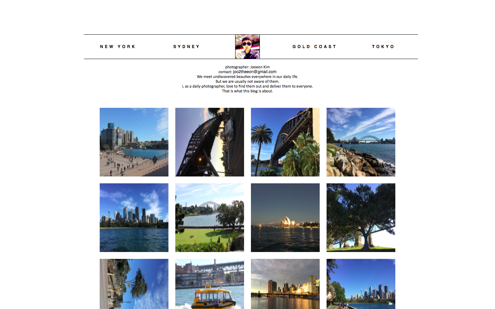

# blog

## 프로젝트 설명

- 이 프로젝트는 HTML, CSS, SCSS 를 학습하기 위해 만든 프로젝트입니다.  
- 하나의 단일 html 페이지로 이루어져 있으며, SCSS 로 CSS 를 짰습니다.
- 이 페이지에 사용된 이미지는 제가 직접 찍은 것이라 깃헙에는 공유하지 않았습니다. 
- 17년 9월 경에 작업한 프로젝트입니다.

## 실행화면

#### 기본화면

#### Navigation bar 에 커서를 올렸을 때
